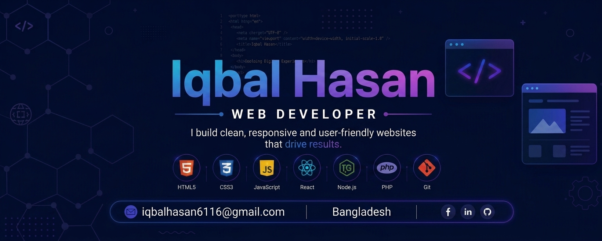

<!--- banner --->

 

<!-- ======================= INTRO ======================= -->

<h1 align="center">Hi 👋, I'm Iqbal Hasan</h1>

<h3 align="center">
  🌱 Learning Full-Stack Development
</h3>

  JavaScript • TypeScript • React • Node.js

## 👋 About Me

A passionate developer and researcher focused on **Web Development**, **Software Engineering**, and **Software Architecture Design**. I enjoy working on real-world problems.

- 🔭 Currently working on **React with TypeScript**
- 🌱 Exploring **Next.js** and modern full-stack web development
- 🧠 Researching **Software Architecture**
- 🛠️ Building a **Portfolio** with interactive features
- 💡 Interested in **open-source contributions** and collaborative research
- 📍 Based in **Dhaka, Bangladesh**
- 📬 Reach me at: **iqbalhasan6116@gmail.com**

---

## 🌱 Currently Learning

  
  
  
  
  
  
  
  
  
  
  
  
  

---

## 🛠️ Technologies & Tools

### Languages:

  
  
  
  
  
  

### CSS Frameworks & Libraries:

  
  
  

### JavaScript Frameworks & Libraries:

  
  
  
  
  

### Database & ORM:

  
  
  
  
  

### Deployment Platform:

  
  
  

### Design & Graphics:

  
  
  

### Tools & Technologies:

  
  
  
  
  
  
  
  

---

## 📊 GITHUB STATISTICS & ANALYSIS

### 🔥 Contribution Streak

  

## 🤝 Connect With Me

